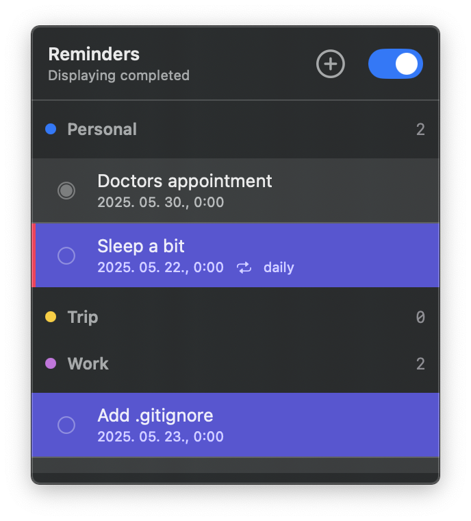
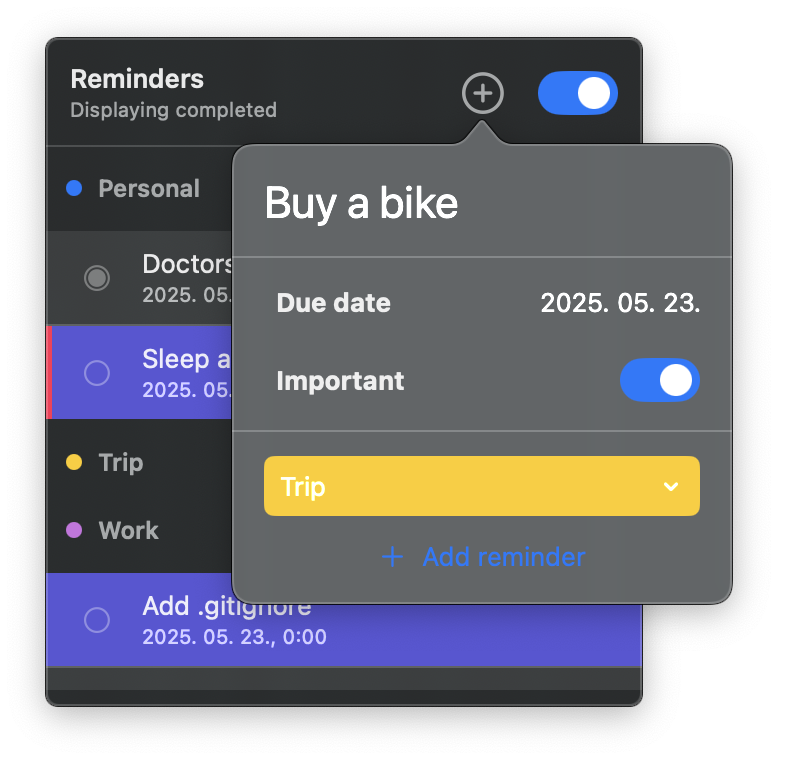

<h1 align="center">Reminders Extra</h1>

    The application is an alternative for the built-in macOS Reminders application (altough intentionally not in feature parity.)

## What does it solve?
Even tough I like the iOS application, using Reminders on macOS is not convinient for me.
It isn't suited for quickly picking up todos during meetings or so.

## Technical details
I tried to use SwiftUI for everything for the better or worse.
You may download it from the Releases section: the application is signed and notarized.

## Features
- [x] Highlight important todos
- [x] Highlight expired todos
- [x] Add new todo (title, due date, importance, list)
- [x] List todos grouped by Lists
- [x] Show completed todos within a List
- [x] Color code Lists

## Screens

### List reminders

### Add new reminder

